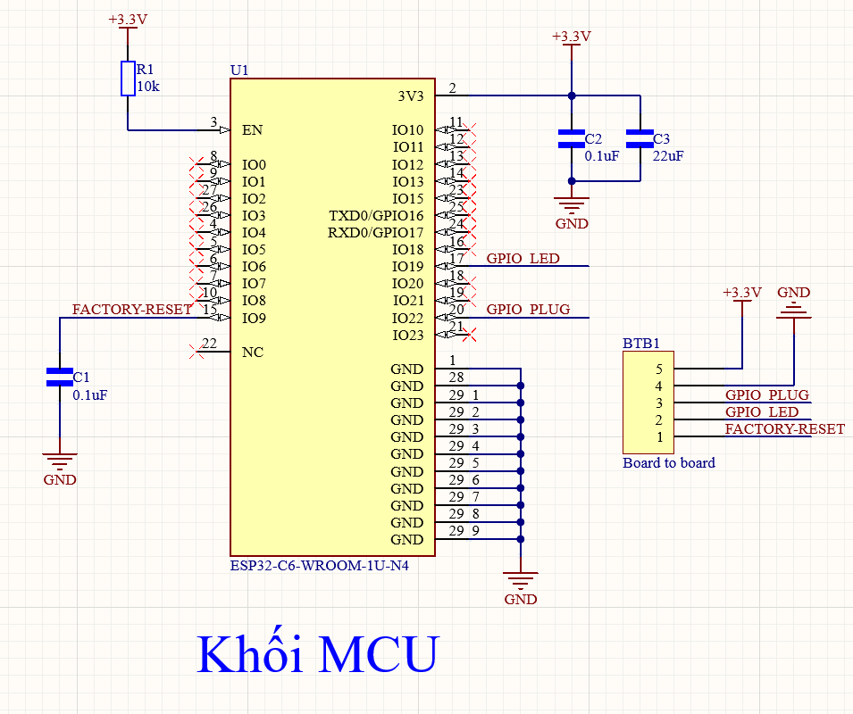

# Matter Plug ESP32
## SDK Version:
- ESP-IDF: [v5.4.1](https://github.com/espressif/esp-idf/tree/v5.4.1)<br>
- ESP-Matter-1.4: [de9164fbfd89a83fade503e67f6f0fb1931a1b95](https://github.com/espressif/esp-matter/tree/de9164fbfd89a83fade503e67f6f0fb1931a1b95)<br>
- Connectedhomeip: [7a54749dc9df8706510767513f2f5656a3bd6f68](https://github.com/project-chip/connectedhomeip/tree/7a54749dc9df8706510767513f2f5656a3bd6f68)<br>

## Build & Flash Firmware:
Recommended before flashing:
```c
idf.py -p /dev/ttyACM0 erase-flash
```

1. Flash secure cert partition. Please check partition table for esp_secure_cert partition address.

```c
esptool.py -p /dev/ttyACM0 write_flash 0xd000 /.../ESP-Matter-Smart-Plug/certification/DACProvider/esp_secure_cert.bin
```
2. Flash factory partition, Please check the CONFIG_CHIP_FACTORY_NAMESPACE_PARTITION_LABEL for factory partition label. Then check the partition table for address and flash at that address.

```c
esptool.py -p /dev/ttyACM0 write_flash 0x10000 /.../ESP-Matter-Smart-Plug/certification/DACProvider/partition.bin
```
3. Config project
```c
idf.py set-target esp32c6
```

4. Flash Firmware

```c
idf.py -p /dev/ttyACM0 flash monitor
```

## Software (Matter)

### Commissioning (Pairing) lần đầu

1. **Khởi động thiết bị** 
   - LED Blue sáng báo nguồn và Plug cùng LED RED tắt
   - LED BLUE ON -> (PLUG và LED RED OFF)
   - LED BLUE OFF -> (PLUG và LED RED ON)
2. **Nhấn giữ nút 5 giây** 
   - LED BlUE bắt đầu nhấp nháy (chế độ Commingssioning)
3. **Mở app Matter Controller**:
   - Google Home: Add Device → Matter
   - Apple Home: Add Accessory → Scan QR Code
   - Amazon Alexa: Add Device → Matter
4. **Quét QR code** hoặc nhập thủ công với Setup Code
5. **Hoàn tất commissioning** - LED ngừng nhấp nháy 

### Chức năng nút nhấn

| Thao tác | Chức năng |
|----------|-----------|
| **Nhấn nút ngắn (< 5s)** | Bật/Tắt ổ cắm (Toggle) |
| **Nhấn giữ nút 5s (chưa pair)** | Mở chế độ Commissioning |
| **Nhấn giữ nút 5s (đã pair)** | Factory reset + auto-commissioning |

### Trạng thái LED BLUE

| LED BLUE | Ý nghĩa |
|-----|---------|
| **LED BLUE ON** | Plug (LED RED) OFF|
| **LED BLUE OFF**| Plug (LED RED) ON |
| **Nhấp nháy chậm (500ms)** | Đang ở chế độ commissioning |
| **Nhấp nháy nhanh (200ms)** | Factory reset đang thực hiện |

### Project Tree Structure
```c
ESP-Matter-Smart-Plug/
├── certification/
│   ├── README.md
│   ├── Attestation/
│   │   ├── test-DAC-FFAA-FFA1-cert.der
│   │   ├── test-DAC-FFAA-FFA1-cert.pem
│   │   ├── test-DAC-FFAA-FFA1-key.der
│   │   ├── test-DAC-FFAA-FFA1-key.pem
│   │   ├── test-PAI-FFAA-cert.der
│   │   ├── test-PAI-FFAA-cert.pem
│   │   └── test-PAI-FFAA-key.pem
│   ├── Certification-Declaration/
│   │   └── Chip-Test-CD-FFAA-FFA1.der
│   └── DACProvider/
│       ├── onb_codes.csv
│       └── partition.csv
│       ├── esp_secure_cert.bin
|       └── partition.bin
├── main/
|    ├── app_driver.cpp
|    ├── app_main.cpp
|    ├── app_priv.h
|    ├── CMakeLists.txt
|    └── idf_component.yml
├── CmakeLists.txt
└── partitions.csv
├── README.md
├── sdkconfig.defaults
└── sdkconfig.defaults.esp32c6
```


## Hardware

```c
#define PLUG_GPIO               GPIO_NUM_22
#define LED_GPIO                GPIO_NUM_19
#define BUTTON_GPIO             GPIO_NUM_9
```
1. Schematic and PCB Module ESP32-C6

**Update later**

2. Schematic and PCB Smart Plug

**Update later**

## QR Code for commisioning
<p align="center">
  
</p>

<p align="center"><strong>Setup Code: 1559-121-2356</strong></p>

## Control and Read data using CHIP-TOOL:
1. Start CHIP-TOOL
```c
chip-tool interactive start
```
2. Commissioning using chip-tool: 

Paring: pairing code-wifi 1 MyWifi 12345678  15591212356
```c
pairing code-wifi <node-id> <ssid> <passphrase>  <SetupCode>
```
3. Use the cluster commands to control the attributes.

Toggle: onoff toggle 1 0x1
```c
onoff on <node-id> <bit>
```
Set on: onoff on 1 0x1
```c
onoff on <node-id> <bit>
```
4. Use the cluster commands to read the attributes.

Read Product name and Vendor Name: basicinformation read product-name 1 0
```c
basicinformation read product-name <node-id> <endpoint>
```
```c
basicinformation read vendor-name <node-id> <endpoint>
```

5. Open the commissioning window

Open the commissioning window on the paired Matter device by using the following command pattern: open-commissioning-window 0x2002 1 300 10000 2002
```c
pairing open-commissioning-window <node_id> <option> <window_timeout> <iteration> <discriminator>
```
[More details about CHIP-TOOL](https://project-chip.github.io/connectedhomeip-doc/development_controllers/chip-tool/chip_tool_guide.html)<br>

## Matter Certificate
- Detail in: [Matter Certification](https://github.com/NgTSon/ESP-Matter-Smart-Plug/tree/main/certification)<br>
