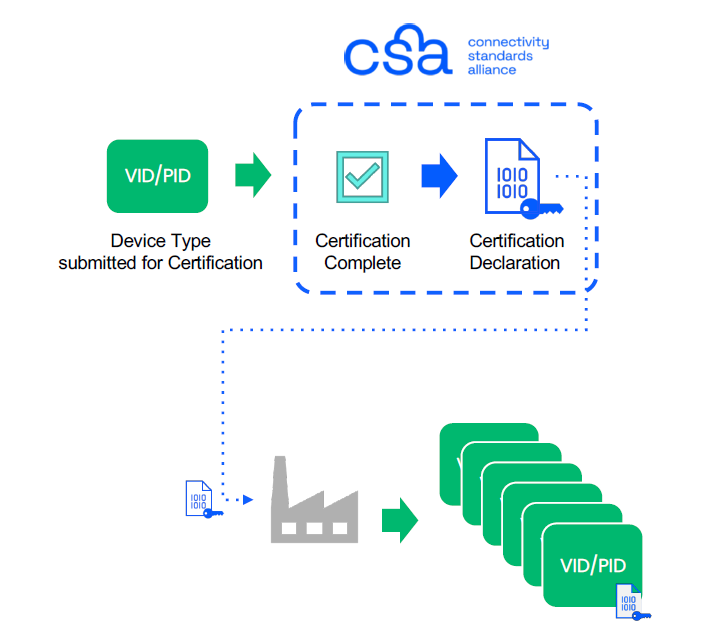
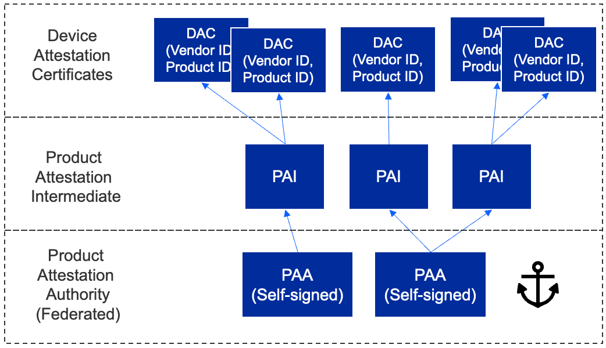

# Matter Security
**Certification Declaration**

Another data construct that is necessary for Device Attestation is the Certification Declaration (CD), which is cryptographically signed by the Connectivity Standards Alliance and contains the Vendor and Device information as well as the PAA of the device. The CD must be put into the Device during manufacturing to be used during the Device Attestation process. The Commissioner will ask for the stored CD during the commissioning of the Node.
<p align="center">
  
</p>
**Device Attestation**
Every device has a unique certificate that is signed by the manufacturer. There is no single root CA across all devices. During commissioning, the device is challenged to prove possession of the associated private key. The certificate can be validated against the Distributed Compliance Ledger (DCL) to verify device certification status.

The hierarchy allows for a 3-level tier:

- The first level is the Product Attestation Authority (PAA).

- The PAA will be used to sign the Product Attestation Intermediate (PAI).

- The PAI will be used to sign the Device Attestation Certificate (DAC). The DAC will be transferred to the commissioner and verified against the DCL.

<p align="center">
  
</p>

The focus of this phase is to verify the authenticity of the Device. The high-level steps are:

1. The Commissioner verifies the Device’s:

- VID

- PID

- Certification status

2. To do so, it uses:

- Device Attestation Credentials

- Distributed Compliance Ledger (DCL) or

- Certification Declaration (CD)

**Read more at:** [Silab Matter Security](https://docs.silabs.com/matter/2.7.0/matter-fundamentals-security/)<br>

# Device certificate generation process
## Create new Certificates for ESP32
### Create the Certificate Declaration
1. The first thing to do is Export your custom VID/PID as environment variables to decrease chances of clerical error when editing your command arguments:
export VID=hexVendorId export PID=hexProductId

```c
export VID=FFAA
export PID=FFA1

echo ${VID} 
echo ${PID} 
```
2. Generate the CD using chip-cert. Currently the Commissioner only validates that the VID and PID match the data exposed elsewhere by the device: the Basic Information Cluster, DAC and DAC origin (when it has it). You may leave the other fields unchanged:

```c
cd ~/esp/esp-matter/connectedhomeip/connectedhomeip
./out/host/chip-cert gen-cd \
  --key credentials/test/certification-declaration/Chip-Test-CD-Signing-Key.pem \
  --cert credentials/test/certification-declaration/Chip-Test-CD-Signing-Cert.pem \
  --out credentials/test/certification-declaration/Chip-Test-CD-${VID}-${PID}.der \
  --format-version "1" \
  --vendor-id "${VID}" \
  --product-id "${PID}" \
  --device-type-id "0x1234" \
  --certificate-id "ZIG20141ZB330001-24" \
  --security-level "0" \
  --security-info "0" \
  --version-number "9876" \
  --certification-type "0"
```

Look in the credentials/test/certification-declaration directory.

3. Verify the CD. Make sure it contains your VID/PID (in decimal format):

```c
./out/host/chip-cert print-cd credentials/test/certification-declaration/Chip-Test-CD-${VID}-${PID}.der
```

### Generate a PAI and DAC
In this example we'll use Matter's own test Product Attestation Authority (PAA) certificate and signing key Chip-Test-PAA-NoVID as our root certificate. We'll use it as the root CA to generate our own PAI and DAC.

4. Generate the PAI

```c
./out/host/chip-cert gen-att-cert --type i \
  --subject-cn "Matter Test PAI" \
  --subject-vid "${VID}" \
  --valid-from "2025-10-20 10:10:10" \
  --lifetime "4294967295" \
  --ca-key credentials/test/attestation/Chip-Test-PAA-NoVID-Key.pem \
  --ca-cert credentials/test/attestation/Chip-Test-PAA-NoVID-Cert.pem \
  --out-key credentials/test/attestation/"test-PAI-${VID}-key".pem \
  --out credentials/test/attestation/"test-PAI-${VID}-cert".pem
```

5. Generate the DAC using the PAI:
```c
./out/host/chip-cert gen-att-cert --type d \
  --subject-cn "Matter Test DAC 0" \
  --subject-vid "${VID}" \
  --subject-pid "${PID}" \
  --valid-from "2025-10-20 10:10:10" \
  --lifetime "4294967295" \
  --ca-key credentials/test/attestation/"test-PAI-${VID}-key".pem \
  --ca-cert credentials/test/attestation/"test-PAI-${VID}-cert".pem \
  --out-key credentials/test/attestation/"test-DAC-${VID}-${PID}-key".pem \
  --out credentials/test/attestation/"test-DAC-${VID}-${PID}-cert".pem
```

6. Verify the DAC, PAI and PAA chain. If no errors appear in the output, it means that the certificate attestation chain is successfully verified:
```c
./out/host/chip-cert validate-att-cert \
--dac credentials/test/attestation/"test-DAC-${VID}-${PID}-cert".pem \
--pai credentials/test/attestation/"test-PAI-${VID}-cert".pem \
--paa credentials/test/attestation/Chip-Test-PAA-NoVID-Cert.pem
```
7. Inspect your keys using openssl:
```c
openssl ec -noout -text -in \
credentials/test/attestation/test-DAC-${VID}-${PID}-key.pem
```

The output should look something like this:
```c
read EC key
Private-Key: (256 bit)
priv:
    e5:82:8c:7d:2d:c1:e3:2a:7c:97:23:bb:d5:42:80:
    32:2f:40:8a:cc:41:4b:ed:26:63:99:2a:8a:d8:dd:
    13:b1
pub:
    04:57:73:31:24:9d:2c:bd:2d:79:cc:f0:2b:f6:3a:
    ee:e6:95:f2:b6:0c:b7:05:1b:24:32:f0:27:5b:a0:
    74:87:91:2b:b7:81:22:5d:c7:41:5b:47:b1:56:0f:
    30:f9:92:2f:5f:70:f4:87:19:67:57:b8:0d:ef:4b:
    56:e3:04:48:36
ASN1 OID: prime256v1
NIST CURVE: P-256
```
8. You may also use openssl to inspect your generated certificates:
```c
 openssl x509 -noout -text -in \
  credentials/test/attestation/test-DAC-${VID}-${PID}-cert.pem
```

```c
Certificate:
    Data:
        Version: 3 (0x2)
        Serial Number: 2325606197042256204 (0x20463683be26994c)
        Signature Algorithm: ecdsa-with-SHA256
        Issuer: CN = Matter Test PAI, 1.3.6.1.4.1.37244.2.1 = FFAA
        Validity
            Not Before: Oct 20 10:10:10 2025 GMT
            Not After : Dec 31 23:59:59 9999 GMT
        Subject: CN = Matter Test DAC 0, 1.3.6.1.4.1.37244.2.1 = FFAA, 1.3.6.1.4.1.37244.2.2 = FFA1
        Subject Public Key Info:
            Public Key Algorithm: id-ecPublicKey
                Public-Key: (256 bit)
                pub:
                    04:57:73:31:24:9d:2c:bd:2d:79:cc:f0:2b:f6:3a:
                    ee:e6:95:f2:b6:0c:b7:05:1b:24:32:f0:27:5b:a0:
                    74:87:91:2b:b7:81:22:5d:c7:41:5b:47:b1:56:0f:
                    30:f9:92:2f:5f:70:f4:87:19:67:57:b8:0d:ef:4b:
                    56:e3:04:48:36
                ASN1 OID: prime256v1
                NIST CURVE: P-256
        X509v3 extensions:
            X509v3 Basic Constraints: critical
                CA:FALSE
            X509v3 Key Usage: critical
                Digital Signature
            X509v3 Subject Key Identifier: 
                E6:1A:B3:A7:59:D5:89:AE:7D:EC:E3:68:F6:96:AC:00:46:90:C6:D3
            X509v3 Authority Key Identifier: 
                82:DE:2F:D5:6B:5B:87:C5:AC:46:CD:E8:38:F1:64:39:82:97:A7:4D
    Signature Algorithm: ecdsa-with-SHA256
    Signature Value:
        30:46:02:21:00:b7:60:b8:c9:50:18:82:69:e8:3c:bf:73:52:
        80:02:cb:4b:4e:8b:b7:bb:f9:b9:fb:15:6a:7b:c5:a1:5c:0e:
        55:02:21:00:91:21:05:55:7e:bf:dc:59:41:a9:c9:8c:3c:12:
        75:3f:11:bb:18:df:fb:a4:83:b1:d4:8a:45:55:cf:fb:92:0c
```
Note: A similar process could be used for generating a self-signed PAA, but doing so is not necessary.

Instead, what we've done here is to use an existing self-signed development PAA that doesn't include VID information.

For more examples of generating a CD, look at credentials/test/gen-test-cds.sh And for more examples of generating a PAA, PAI, and DAC, see credentials/test/gen-test-attestation-certs.sh

## Hard coding the DAC
In this section we will hard code the DAC certs
### Use a script to generate template code

1. Save the following script into a file called generate-embeddable-certs.sh into "esp/esp-matter/connectedhomeip/connectedhomeip/credentials/test"

```c
#!/bin/bash

#
# generate-embeddable-certs.sh script
# —----------------------------------
#
# This script generates self-minted DAC and PAI.
# The output may easily be included in your C++ source code.
#

# Edit this information with your paths and certificates
folder="/home/ntson/esp/esp-matter/connectedhomeip/connectedhomeip/credentials/test/attestation"  ########## my addr
chip_cert_tool="/home/ntson/esp/esp-matter/connectedhomeip/connectedhomeip/out/host/chip-cert"    ########## my addr
cert_file_der="${folder}/test-PAI-${VID}-cert.der"
cert_file_pem="${folder}/test-PAI-${VID}-cert.pem"
key_file_pem="${folder}/test-PAI-${VID}-key.pem"

type="Pai"

printf "namespace chip {\n"
printf "namespace DevelopmentCerts {\n\n"
printf "#if CHIP_DEVICE_CONFIG_DEVICE_VENDOR_ID == 0x${VID} && CHIP_DEVICE_CONFIG_DEVICE_PRODUCT_ID == 0x${PID}\n\n"

printcert() {
  # convert cert to DER
  if [ -f "${cert_file_der}" ]; then
      rm "${cert_file_der}"
  fi
  "${chip_cert_tool}" convert-cert "${cert_file_pem}" "${cert_file_der}" --x509-der

  printf "// ------------------------------------------------------------ \n"
  printf "// ${type} CERTIFICATE ${cert_file_der} \n\n"

  printf "constexpr uint8_t ${type}_Cert_Array[] = {\n"
  less -f "${cert_file_der}" | od -t x1 -An | sed 's/\</0x/g' | sed 's/\>/,/g' | sed 's/^/   /g'
  printf "};\n\n"
  printf "ByteSpan k${type}Cert = ByteSpan(${type}_Cert_Array);\n\n"

  printf "// ${type} PUBLIC KEY FROM ${key_file_pem} \n\n"

  printf "constexpr uint8_t ${type}_PublicKey_Array[] = {\n"
  openssl ec -text -noout -in "${key_file_pem}" 2>/dev/null | sed '/ASN1 OID/d' | sed '/NIST CURVE/d' | sed -n '/pub:/,$p' | sed '/pub:/d' | sed 's/\([0-9a-fA-F][0-9a-fA-F]\)/0x\1/g' | sed 's/:/, /g'
  printf "};\n\n"
  printf "ByteSpan k${type}PublicKey = ByteSpan(${type}_PublicKey_Array);\n\n"

  printf "// ${type} PRIVATE KEY FROM ${key_file_pem} \n\n"

  printf "constexpr uint8_t ${type}_PrivateKey_Array[] = {\n"
  openssl ec -text -noout -in "${key_file_pem}" 2>/dev/null | sed '/read EC key/d' | sed '/Private-Key/d' | sed '/priv:/d' | sed '/pub:/,$d' | sed 's/\([0-9a-fA-F][0-9a-fA-F]\)/0x\1/g' | sed 's/:/, /g'
  printf "};\n\n"
  printf "ByteSpan k${type}PrivateKey = ByteSpan(${type}_PrivateKey_Array);\n\n"
}

# generates PAI
printcert

type="Dac"
cert_file_der="${folder}/test-DAC-${VID}-${PID}-cert.der"
cert_file_pem="${folder}/test-DAC-${VID}-${PID}-cert.pem"
key_file_pem="${folder}/test-DAC-${VID}-${PID}-key.pem"

# generates DAC
printcert

printf "#endif // CHIP_DEVICE_CONFIG_DEVICE_PRODUCT_ID\n"
printf "} // namespace DevelopmentCerts\n"
printf "} // namespace chip\n"
```

2. Run the script from the connectedhomeip folder
```c
cd ~/esp/esp-matter/connectedhomeip/connectedhomeip/credentials/test/
chmod +x generate-embeddable-certs.sh 
./generate-embeddable-certs.sh 
```

3. Edit the ExampleDACs.cpp file.
```c
cd  ~/esp/esp-matter/connectedhomeip/connectedhomeip/src/credentials/examples/
code ExampleDACs.cpp
```
Insert the template code into the very end of function

4. Replace the CD (certification-declaration)
Extract a text representation of the contents of your CD file using xxd:

```c
xxd -i credentials/test/certification-declaration/Chip-Test-CD-${VID}-${PID}.der
```

5. Edit the ExampleDACProvider::GetCertificationDeclaration, in src/credentials/examples/DeviceAttestationCredsExample.cpp
```c
cd  ~/esp/esp-matter/connectedhomeip/connectedhomeip/src/credentials/examples/
code DeviceAttestationCredsExample.cpp
```

```c
#elif CHIP_DEVICE_CONFIG_DEVICE_VENDOR_ID == 0xFFAA
    const uint8_t kCdForAllExamples[] = {
        0x01, 0xaa, 0xff, 0x36, 0x02, 0x05, 0xa1, 0xff, 0x18, 0x25, 0x03, 0x34,
        0x12, 0x2c, 0x04, 0x13, 0x5a, 0x49, 0x47, 0x32, 0x30, 0x31, 0x34, 0x31,
        0x5a, 0x42, 0x33, 0x33, 0x30, 0x30, 0x30, 0x31, 0x2d, 0x32, 0x34, 0x24,
        0x05, 0x00, 0x24, 0x06, 0x00, 0x25, 0x07, 0x76, 0x98, 0x24, 0x08, 0x00,
        0x18, 0x31, 0x7c, 0x30, 0x7a, 0x02, 0x01, 0x03, 0x80, 0x14, 0x62, 0xfa,
        0x82, 0x33, 0x59, 0xac, 0xfa, 0xa9, 0x96, 0x3e, 0x1c, 0xfa, 0x14, 0x0a,
        0xdd, 0xf5, 0x04, 0xf3, 0x71, 0x60, 0x30, 0x0b, 0x06, 0x09, 0x60, 0x86,
        0x48, 0x01, 0x65, 0x03, 0x04, 0x02, 0x01, 0x30, 0x0a, 0x06, 0x08, 0x2a,
        0x86, 0x48, 0xce, 0x3d, 0x04, 0x03, 0x02, 0x04, 0x46, 0x30, 0x44, 0x02,
        0x20, 0x5d, 0x0f, 0x5e, 0x52, 0x07, 0xea, 0x49, 0x12, 0xe0, 0x12, 0x0d,
        0xc8, 0x9e, 0xc6, 0x2f, 0x51, 0xcc, 0x42, 0x99, 0xdc, 0xed, 0x1b, 0x63,
        0xe5, 0x95, 0xe1, 0x0a, 0xbb, 0xf8, 0xef, 0xd2, 0xba, 0x02, 0x20, 0x64,
        0x33, 0xa2, 0xf3, 0x78, 0xa8, 0xbd, 0x4b, 0x27, 0xbe, 0x6c, 0xfb, 0x52,
        0xdc, 0x5b, 0xda, 0x69, 0xd5, 0x0a, 0x1a, 0xca, 0xbe, 0xfb, 0x96, 0x8b,
        0xf7, 0xdf, 0xf9, 0xf2, 0xf9, 0x5a, 0x2c
    };
};
#Put this code just before the last else code
#else  /* Fall back to the VID=0xFFF1 CD */
```
If everything is working you should be able to build and flash the new matter app.

## Generate PKI credentials for ESP32 matter devices in esp_secure_cert partition
In this section, we will generate PKI credentials for ESP32 matter devices and store them in esp_secure_cert partition
1. Change format for the certificates and key (.pem to .der format).
Convert DAC key from .pem to .der format.

```c
openssl ec -in credentials/test/attestation/"test-DAC-${VID}-${PID}-key".pem -out credentials/test/attestation/"test-DAC-${VID}-${PID}-key".der -inform pem -outform der
```

Convert DAC and PAI cert from .pem to .der format

```c
openssl x509 -in credentials/test/attestation/"test-DAC-${VID}-${PID}-cert".pem -out credentials/test/attestation/"test-DAC-${VID}-${PID}-cert".der -inform pem -outform der
openssl x509 -in credentials/test/attestation/"test-PAI-${VID}-cert".pem -out credentials/test/attestation/"test-PAI-${VID}-cert".der -inform pem -outform der
```

2. Generate and flash the secure partition The following command generates the secure cert partition and flashes it to the connected device. Additionally, it preserves the generated partition on the host, allowing it to be flashed later if the entire flash is erased.


```c
configure_esp_secure_cert.py --private-key credentials/test/attestation/"test-DAC-${VID}-${PID}-key".der \
    --device-cert credentials/test/attestation/"test-DAC-${VID}-${PID}-cert".der \
    --ca-cert credentials/test/attestation/"test-PAI-${VID}-cert".der \
    --target_chip esp32c6 \
    --keep_ds_data_on_host \
    --port /dev/ttyACM0 \
    --priv_key_algo ECDSA 256
```

You should notice that a new esp_secure_cert_data folder is created with the esp secure cert file. (cd  ~/esp/esp-matter/connectedhomeip/connectedhomeip/esp_secure_cert_data/)

## Configure the esp Matter application to use the secure certificates
We must now set up the configuration
1. Edit the sdkconfig file and add the following code:
```c
# Disable the DS Peripheral support
CONFIG_ESP_SECURE_CERT_DS_PERIPHERAL=n

# Use DAC Provider implementation which reads attestation data from secure cert partition
CONFIG_SEC_CERT_DAC_PROVIDER=y

# Enable some options which reads CD and other basic info from the factory partition
CONFIG_ENABLE_ESP32_FACTORY_DATA_PROVIDER=y
CONFIG_ENABLE_ESP32_DEVICE_INSTANCE_INFO_PROVIDER=y
CONFIG_FACTORY_COMMISSIONABLE_DATA_PROVIDER=y
CONFIG_FACTORY_DEVICE_INSTANCE_INFO_PROVIDER=y
```
## Factory Partition
We will not set up the Factory partition which contains basic information like VID, PID, etc, and CD.
1. Export the dependent tools path

```c
cd ~/esp/esp-matter/connectedhomeip/connectedhomeip/credentials/test/certification-declaration
cp Chip-Test-CD-FFAA-FFA1.der ~/esp/esp-matter/tools/mfg_tool/Chip-Test-CD-FFAA-FFA1.der

cd ~/esp/esp-matter/tools/mfg_tool/ 
export PATH=$PATH:$PWD/../../connectedhomeip/connectedhomeip/out/host
```

Generate the factory partition, please use the APPROPRIATE values for -v (Vendor Id), -p (Product Id), and -cd (Certification Declaration).

```c
esp-matter-mfg-tool --passcode 20241000 \
                    --discriminator 2002 \
                    -cd Chip-Test-CD-FFAA-FFA1.der \
                    -v 0xFFAA --vendor-name NTS-20241000E \
                    -p 0xFFA1 --product-name Plug\
                    --hw-ver 1 --hw-ver-str DevKit
```

Few important output lines are mentioned below. Please take a note of onboarding codes, these can be used for commissioning the device.
```c
[2025-10-22 13:32:54,634] [   INFO] - Do not include the device attestation certificates and keys in partition binaries
[2025-10-22 13:32:54,634] [   INFO] - Number of manufacturing NVS images to generate: 1
[2025-10-22 13:32:54,666] [   INFO] - Generated output files at: /home/ntson/esp/esp-matter/tools/mfg_tool/out/fff1_8001/8f0dad84-6549-49f6-9020-53857036771a
[2025-10-22 13:32:54,666] [   INFO] - Generated summary CSV: /home/ntson/esp/esp-matter/tools/mfg_tool/out/fff1_8001/summary-2025-10-22-13-32-54.csv
```

## Flashing firmware, secure cert and factory partition
Recommended before flashing:
```c
idf.py -p /dev/ttyACM0 erase-flash
```

1. Flash secure cert partition. Please check partition table for esp_secure_cert partition address.

```c
esptool.py -p /dev/ttyACM0 write_flash 0xd000 /home/ntson/esp/esp-matter/connectedhomeip/connectedhomeip/esp_secure_cert_data/esp_secure_cert.bin
```
2. Flash factory partition, Please check the CONFIG_CHIP_FACTORY_NAMESPACE_PARTITION_LABEL for factory partition label. Then check the partition table for address and flash at that address.

```c
esptool.py -p /dev/ttyACM0 write_flash 0x10000 /home/ntson/esp/esp-matter/tools/mfg_tool/out/fff1_8001/8f0dad84-6549-49f6-9020-53857036771a/8f0dad84-6549-49f6-9020-53857036771a-partition.bin
```
3. Flash applications

```c
idf.py -p /dev/ttyACM0 flash
```